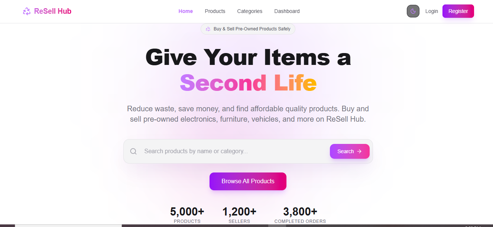

# 🛒 ReSell Hub

> A modern full-stack second-hand marketplace platform where users can securely buy and sell pre-owned products. ReSell Hub promotes sustainable shopping by reducing waste and making quality products more affordable.

## 🌐 Live Demo

🔗 **Live Site:** https://a10-forntend.vercel.app

## 📂 Source Code

- **Frontend:** https://github.com/mdmonimul95-crypto/A10-forntend
- **Backend:** https://github.com/mdmonimul95-crypto/A10-server

---

## 📸 Screenshots

### 🏠 Home Page



### 🛍️ Products


### 📊 Dashboard


---

## 📖 Project Purpose

ReSell Hub is a full-stack marketplace where users can buy and sell second-hand products securely.

The platform enables sellers to list products while buyers can browse, search, wishlist, order, and complete secure payments using Stripe.

### Goals

- ♻️ Reduce waste
- 🌱 Promote sustainable shopping
- 💰 Help users earn from unused products
- 🛍️ Make quality products affordable

---

# ✨ Features

### 🔐 Authentication

- Better Auth
- Email & Password Login
- Google Login
- JWT Authentication
- Protected Routes
- Role-Based Authorization

### 🛒 Marketplace

- Browse Products
- Product Details
- Dynamic Categories
- Featured Products
- Wishlist
- Advanced Search
- Sorting
- Pagination

### 👤 Buyer Dashboard

- Dashboard Overview
- My Orders
- Wishlist
- Payment History
- Profile Management

### 🏪 Seller Dashboard

- Dashboard Statistics
- Add Product
- Manage Products
- Manage Orders
- Sales Analytics

### 👑 Admin Dashboard

- Dashboard Analytics
- Manage Users
- Manage Products
- Manage Orders
- Payment Monitoring

### 💳 Payment

- Stripe Checkout
- Payment Validation
- Payment Success Page
- Transaction History

### 🎨 UI

- Responsive Design
- Skeleton Loader
- Framer Motion
- Custom 404
- Marketplace Statistics
- Success Stories
- Sustainability Section

### ⭐ Extra Features

- Dark / Light Theme
- Seller Verification Badge
- Recently Viewed Products
- Product Comparison
- Product Reporting System

---

# 🛠️ Tech Stack

## Frontend

- Next.js
- React
- TypeScript
- Tailwind CSS
- Shadcn UI
- TanStack Query
- React Hook Form
- Zod
- Axios
- Framer Motion

## Backend

- Node.js
- Express.js
- MongoDB
- Better Auth
- JWT
- Stripe
- Cloudinary

---

# 🔒 Security

- JWT Authentication
- Better Auth
- Protected APIs
- Protected Routes
- Role-Based Access Control
- Environment Variables

---

# 📱 Responsive Design

✅ Mobile

✅ Tablet

✅ Laptop

✅ Desktop

---

# 🚀 Installation

## Clone

```bash
git clone https://github.com/mdmonimul95-crypto/A10-forntend.git
git clone https://github.com/mdmonimul95-crypto/A10-server.git
```

## Frontend

```bash
cd A10-forntend
npm install
npm run dev
```

## Backend

```bash
cd A10-server
npm install
npm run dev
```

---

# 🔑 Environment Variables

### Frontend

```env
NEXT_PUBLIC_API_URL=
NEXT_PUBLIC_STRIPE_PUBLISHABLE_KEY=
```

### Backend

```env
PORT=
MONGODB_URI=
JWT_SECRET=
BETTER_AUTH_SECRET=
GOOGLE_CLIENT_ID=
GOOGLE_CLIENT_SECRET=
STRIPE_SECRET_KEY=
CLOUDINARY_CLOUD_NAME=
CLOUDINARY_API_KEY=
CLOUDINARY_API_SECRET=
```

---

# 🚀 Future Improvements

- Product Reviews
- Real-time Chat
- Email Notifications
- AI Product Recommendation
- Inventory Alerts

---

# 🌍 Deployment

- Frontend: Vercel
- Backend: Vercel
- Database: MongoDB Atlas
- Image Storage: Cloudinary

---

# 👨‍💻 Author

**MD. Monimul Islam**

- Portfolio: https://portfolio-website-teal-nine-ze3ou9enjl.vercel.app
- LinkedIn: https://www.linkedin.com/in/mdmonimul/
- GitHub: https://github.com/mdmonimul95-crypto
- Email: mdmonimul95@gmail.com

---

# 📜 License

This project is developed for educational purposes and portfolio showcase.
